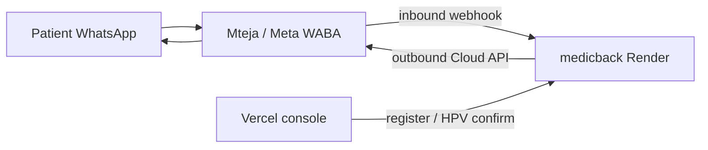

# Go live: WhatsApp with Mteja + Afya Rafiki (medicback)

This guide is for **Nyeri Town Health Center** using **Mteja** as the WhatsApp Business provider and **medicback** (`https://medicback.onrender.com`) for Afya Rafiki automation.

Today the app supports:

| Channel | Provider options |
|---------|------------------|
| **SMS** | Africa's Talking (unchanged) |
| **WhatsApp** | Africa's Talking **or** Meta WhatsApp Cloud API (`WHATSAPP_PROVIDER=cloud`) — use Cloud when Mteja gives you Meta/WABA credentials |

---

## Go live tomorrow — 24-hour checklist

**Reality:** Meta templates often take 24–48h. You can still go live tomorrow using **session messages** (patient texts the hospital number first) + **SMS** for the first outbound until templates are approved.

### Tonight (30 min max)

| # | You | Mteja (email/call) |
|---|-----|-------------------|
| 1 | Submit **4 urgent templates** in Mteja: welcome EN/SW, HPV positive EN/SW (from `WHATSAPP_MESSAGE_TEMPLATES.md`) | Ask **expedited approval** + Meta credentials **tonight** |
| 2 | Generate verify token (long random password); save in Notes | Register webhook URL below |
| 3 | Send email (Part 6 below) — paste verify token in a separate line to them | Confirm WABA number is active |

**Webhook URL (give Mteja):** `https://medicback.onrender.com/webhook_whatsapp.php`  
**Skip for day 1:** Mteja Chatbot flows, Web Query, session notification URL (optional later).

### Tomorrow morning — technical (20 min)

1. **Render** → medicback → Environment → add:
   - `WHATSAPP_PROVIDER=cloud`
   - `WHATSAPP_ACCESS_TOKEN` = from Mteja
   - `WHATSAPP_PHONE_NUMBER_ID` = from Mteja
   - `WHATSAPP_VERIFY_TOKEN` = same string you gave Mteja
2. **Save** → wait for redeploy (~2 min).
3. Open: `https://medicback.onrender.com/api/messaging_health.php`  
   - Need: `"whatsapp_cloud_ready": true`
4. **Webhook test:** Mteja/Meta “Verify” on webhook, or send *Hi* from your phone to the hospital WhatsApp number → you should get an Afya Rafiki reply.

### Tomorrow — hospital workflow (pilot: 3 patients)

| Step | Staff action |
|------|----------------|
| A | Patient **opts in** on paper; register in console with channel **WhatsApp**, phone `+2547…` |
| B | **If templates not approved yet:** patient opens WhatsApp → sends **Hi** to hospital number (opens 24h window) |
| C | Staff confirms HPV / books appointment in console → system sends WhatsApp (works inside 24h window) |
| D | **Welcome before Hi:** use **SMS** for welcome today, or wait until welcome template is approved |
| E | Patient types **HELP** → menu; **DOCTOR** → escalation |

### If something fails

| Symptom | Fix |
|---------|-----|
| `whatsapp_cloud_ready: false` | Token or phone number ID missing on Render |
| No reply to *Hi* | Webhook not registered or wrong verify token |
| Welcome not on WhatsApp | Template not approved — use SMS or patient sends Hi first |
| `131047` / template errors from Meta | Outside 24h window — need approved template |

### Definition of “live tomorrow”

- Hospital WhatsApp number answers **HELP** / **DOCTOR** via medicback.  
- Staff can register patients and send **results/reminders on WhatsApp** after patient has messaged once (or when templates approved).  
- SMS stays on for welcome/backup until all templates are green in Mteja.

---

## Part 1 — What to request from Mteja

Email **support@mteja.io** (or your account manager) with the checklist below.

### A. WhatsApp Business account (WABA)

- [ ] WhatsApp Business API number for **Nyeri Town Health Center** (dedicated line, not personal WhatsApp)
- [ ] Display name approved (e.g. *Nyeri Town Health Center* or *Afya Rafiki*)
- [ ] Facebook Business verification completed (if not already)
- [ ] Confirm who owns the WABA: hospital vs Mteja (you need API or webhook access either way)

### B. API / credentials for **outbound** messages (medicback sends welcome, results, reminders)

Ask explicitly:

> We need to send **session messages** and **template messages** from our PHP backend (Render). Please provide either:
>
> 1. **Meta Cloud API credentials** (preferred for our integration):
>    - Permanent or long-lived **access token**
>    - **Phone number ID**
>    - **WhatsApp Business Account ID** (WABA ID)
>    - App **verify token** (we choose; you register it on the webhook)
>
> 2. **Or** Mteja REST API documentation: base URL, API key, send-message endpoint, and JSON format for text messages to `+254…` numbers.

### C. **Inbound** messages (patient replies → Afya Rafiki AI)

Ask them to configure the **webhook callback** to medicback:

| Purpose | URL |
|---------|-----|
| Incoming WhatsApp (Meta Cloud format) | `https://medicback.onrender.com/webhook_whatsapp.php` |
| Legacy Africa's Talking (if still used for WA) | `https://medicback.onrender.com/webhook_africastalking.php` |

**Verify token** (you generate; share with Mteja): e.g. a long random string — set the same value in Render as `WHATSAPP_VERIFY_TOKEN`.

Subscribe webhook fields (Meta): `messages` (required), `message_deliveries` (recommended).

If Mteja only supports forwarding via **their** dashboard (not Meta directly), ask:

- [ ] Can inbound WhatsApp be POSTed to our URL above?
- [ ] Sample JSON payload for an incoming text message
- [ ] How outbound send is authenticated from our server

### D. Message templates (Meta approval)

Outside the 24-hour chat window, WhatsApp requires **pre-approved templates** for proactive messages.

Ask Mteja to submit / approve templates using the ready-made pack:

**See `hospital_portal/docs/WHATSAPP_MESSAGE_TEMPLATES.md`** — **84 templates** (Phase 1–3) EN/SW.  
**FAQ knowledge bases:** `MTEJA_KNOWLEDGE_BASE_EN.md` (English) and `MTEJA_KNOWLEDGE_BASE_SW.md` (Kiswahili) — one Mteja KB per language.

| Template name (EN example) | When sent |
|----------------------------|-----------|
| `afya_welcome_en` | Right after registration (opt-in) |
| `afya_hpv_neg_hivpos_en` | HPV negative, HIV+ (3-year return) |
| `afya_hpv_neg_hivneg_en` | HPV negative, HIV− (5-year return) |
| `afya_hpv_positive_en` | HPV positive + appointment date |
| `afya_appt_reminder_7d_en` | 7 days before appointment |
| `afya_appt_reminder_3d_en` | 3 days before |
| `afya_appt_reminder_1d_en` | Day before |
| `afya_via_referral_en` | VIA referral (specialist pathway) |

Until templates are approved, Mteja may allow **session messages** only after the patient has messaged first within 24 hours. Plan a short pilot: nurse asks patient to send *Hi* to the hospital WhatsApp number after registration.

### E. Commercial / ops

- [ ] Pricing per conversation (marketing / utility / service)
- [ ] KES billing or invoice
- [ ] SLA and support contact for go-live week
- [ ] Test number or sandbox for UAT before 60–80 patients

---

## Part 2 — What you configure on Render (medicback)

After Mteja provides credentials, set in **Render → Environment**:

### WhatsApp via Meta Cloud (recommended with Mteja WABA)

```env
WHATSAPP_PROVIDER=cloud
WHATSAPP_ACCESS_TOKEN=<from Mteja / Meta>
WHATSAPP_PHONE_NUMBER_ID=<from Mteja / Meta>
WHATSAPP_BUSINESS_ACCOUNT_ID=<optional, for reference>
WHATSAPP_VERIFY_TOKEN=<long random secret; same as registered on webhook>
WHATSAPP_GRAPH_VERSION=v21.0
```

### SMS (keep Africa's Talking)

```env
AFRICASTALKING_MODE=production
AFRICASTALKING_PROD_USERNAME=...
AFRICASTALKING_PROD_API_KEY=...
AFRICASTALKING_PROD_SMS_FROM=...
```

Leave `AFRICASTALKING_PROD_WHATSAPP_FROM` empty if all WhatsApp goes through Cloud/Mteja.

### Other (already required)

```env
GROQ_API_KEY=...
HOSPITAL_NAME=Nyeri Town Health Center
CLINIC_SITE_NAME=Nyeri Town Health Center
```

Redeploy after saving env vars.

---

## Part 3 — Mteja dashboard (their side)

Per [Mteja Help Center](https://help.mteja.io/):

1. **Account setup** — organisation, billing, channel enabled  
2. **WhatsApp channel** — virtual number / WABA linked  
3. **Inbound mode** — configure inbound to **webhook** or API (not only Team Inbox), if you want Afya Rafiki automation instead of manual agents only  
4. **Templates** — create and submit templates listed above  
5. **Webhook** — point to `webhook_whatsapp.php` with your verify token  

Team Inbox can stay for nurses to handle escalations; automated replies still run on medicback when webhook is active.

---

## Part 4 — Hospital console (your side)

1. Register patients with **Contact channel = WhatsApp** and **opt-in** checked (paper consent).  
2. Phone format: `+2547XXXXXXXX` (9 digits after 254).  
3. Run pilot with 2–3 staff phones before the 60–80 rollout.  
4. Check health: `GET https://medicback.onrender.com/api/messaging_health.php`  
   - `whatsapp_ready: true` when Cloud token + phone number ID are set  

---

## Part 5 — Go-live test script

| Step | Action | Expected |
|------|--------|----------|
| 1 | Set env + redeploy Render | `messaging_health` shows `whatsapp_ready: true` |
| 2 | Mteja registers webhook + verify token | GET challenge succeeds |
| 3 | Register test patient (WhatsApp, opt-in) | Welcome WhatsApp received |
| 4 | Reply *HELP* from patient phone | FAQ menu reply |
| 5 | Reply *DOCTOR* | Reason prompt, then escalation in console |
| 6 | Confirm HPV negative / positive | Correct result SMS/WhatsApp |
| 7 | Book appointment | Reminder cron sends 7d/3d/1d (after cron configured) |

---

## Part 6 — Email template for Mteja

```
Subject: WhatsApp API go-live — Nyeri Town Health Center (Afya Rafiki)

Hello Mteja team,

We are launching patient WhatsApp for the HPV Afya Rafiki programme at Nyeri Town Health Center.
Our backend is hosted at: https://medicback.onrender.com

Please help us with:
1. WhatsApp Business API number and WABA setup
2. Meta Cloud API credentials (access token, phone number ID) OR your send-message API docs
3. Webhook configuration:
   - Callback URL: https://medicback.onrender.com/webhook_whatsapp.php
   - Verify token: [we will send separately]
   - Subscribe to: messages (and delivery status if available)
4. Approval of message templates for: welcome, HPV results, appointment reminders (EN/SW)
5. Test window and pricing confirmation

Technical contact: [your name, phone, email]

Thank you,
[Facility name]
```

---

## Architecture (summary)



SMS continues via Africa's Talking only; WhatsApp uses Cloud when `WHATSAPP_PROVIDER=cloud`.

---

*Last updated: June 2026*
